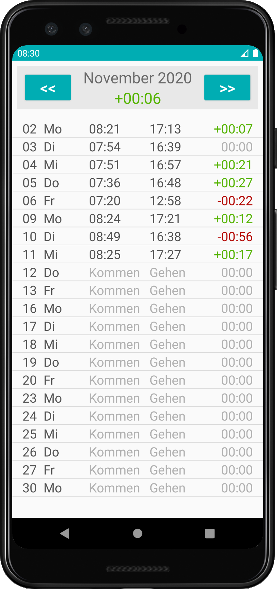

# TimeTracker
A simple Android app for tracking working hours. Enter the time of your arrival at work and the time you finish, and the app will compute your time balance for you.

## Cheat Sheet
| Question                        | Answer                                                        |
|:--------------------------------|:--------------------------------------------------------------|
| What language is it written in? | Java                                                          |
| What do I need to run it?       | Android Studio and a device/emulator with Android 8 or higher |
| How do I run it?                | Check out this repo from within Android Studio                |

